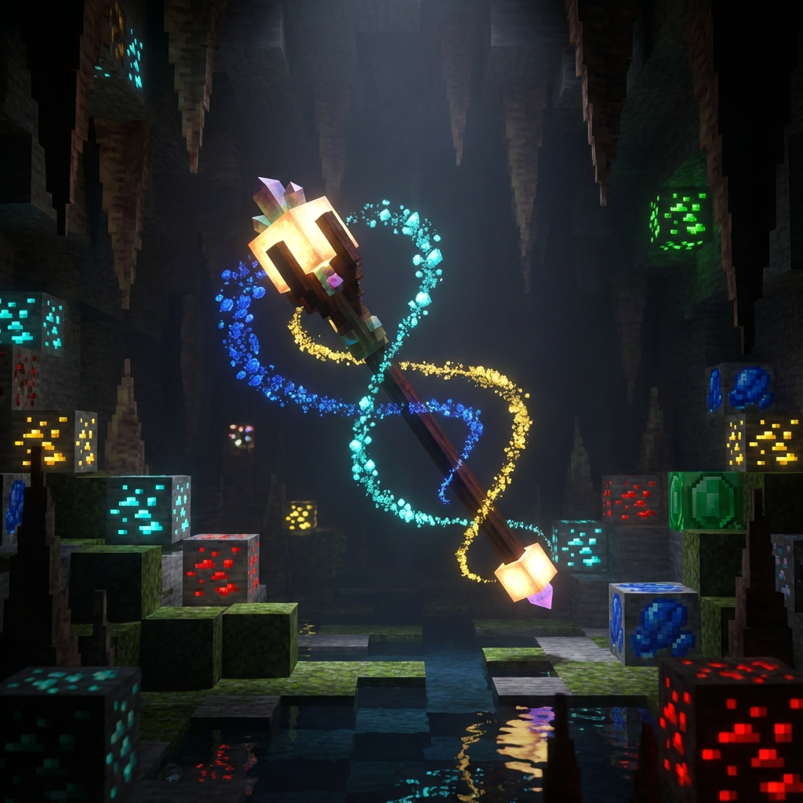
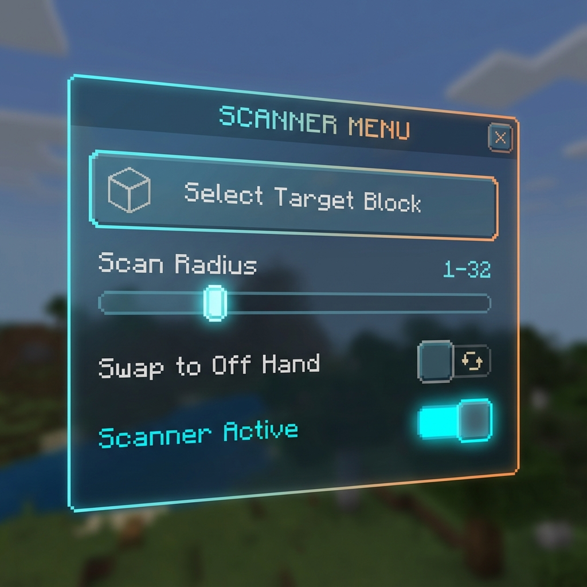
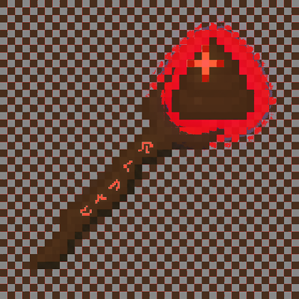
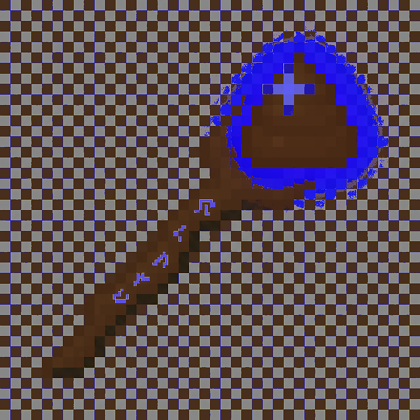
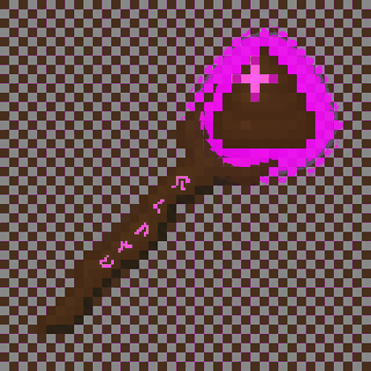
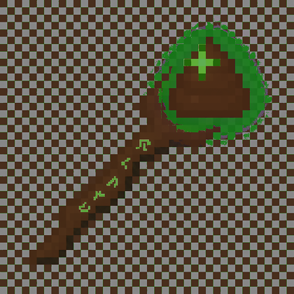
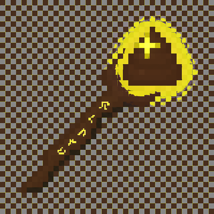

# Smelly Blox Scanner



**Smelly Blox Scanner** is a powerful Minecraft Bedrock Edition addon that helps players find specific blocks (ores, logs, stones, etc.) using a magical glowing staff. It utilizes particle trails and a sleek custom UI to guide you directly to your target.

---

## 🌟 Features

### 🔍 Precision Scanning
Select any block from a categorized and searchable list. The staff will emit a trail of smelly particles from your head to the nearest target blocks within your selected radius.

### 🎮 Modern UI
Refined **Modal Menu** for quick access to all settings:
- **Target Selection**: Categorized and searchable block browser.
- **Radius Control**: Adjustable scan radius via slider.
- **Hand Swapping**: Toggle the staff between your Main Hand and Off Hand with ease.
- **Active Scanning**: Quickly toggle the scanner on or off.



### 🪄 The Smelly Staff
Craftable and dyeable staffs that change particle colors based on their type.
- **Dynamic Particles**: Each staff color has a unique particle effect.
- **Offhand Support**: Use the staff in your offhand while mining!

### Smelly Staff Previews
- Red staff: 
- Blue staff: 
- Magenta staff: 
- Green staff: 
- Yellow staff: 

---

## 🛠️ Build & Installation

### Requirements
- Python 3.x

### Generating the `.mcaddon` File
To package the addon for installation, simply run the build script in the root directory:

```bash
./build.py
```

This will generate a file named `SmellyBlox(version).mcaddon` which you can open to import into Minecraft.

---

## 📁 Project Structure

- `BP/`: Behavior Pack (Scripts, Items, etc.)
- `RP/`: Resource Pack (Textures, Models, etc.)
- `build.py`: Automatic build and packaging script.
- `assets/`: Documentation assets and images.

---

## 📝 Configuration
The scanner loop runs every 10 ticks (configurable in `main.js`) and performs a radial scan centered on the player. Particle flow is optimized to provide visual feedback without excessive lag.

Developed for Minecraft Bedrock 1.21.0+.

## 🔧 Dependencies & Required Setup
- Minecraft Bedrock Edition 1.21.130 or newer (the addon targets 1.21+ APIs).
- Enable the Script Engine / Experimental Features for the world where you install the addon. Make sure both the **Behavior Pack** and **Resource Pack** are active for the world.

No external npm/python packages are required. If you want different staff colors, edit the PNGs in `RP/textures/items/` (the project ships copies of the base texture for each dye color). After editing textures, repackage with `./build.py`.
